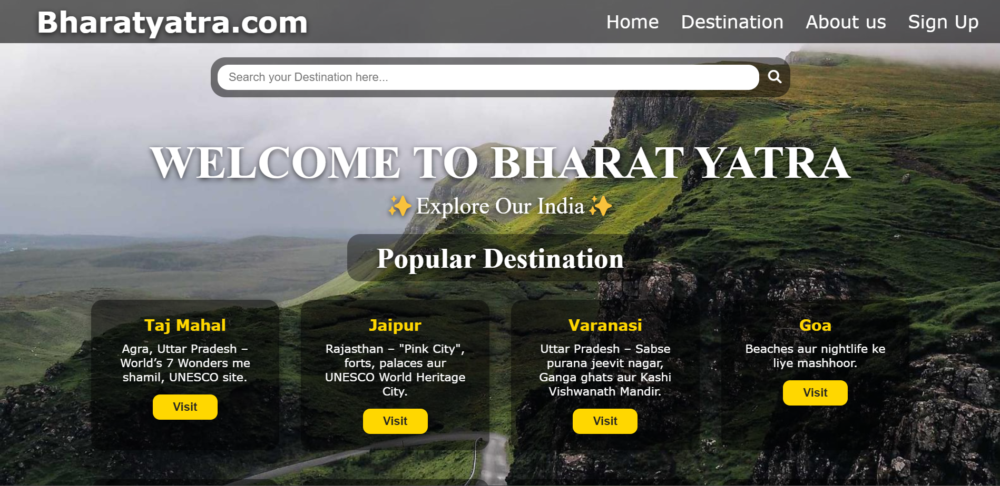
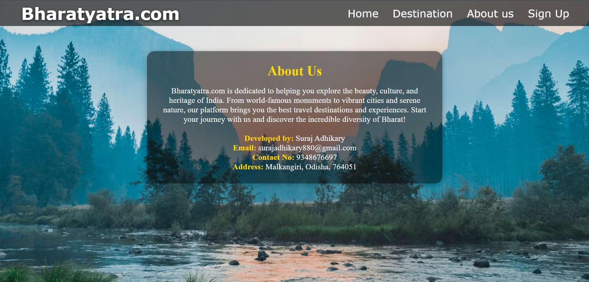
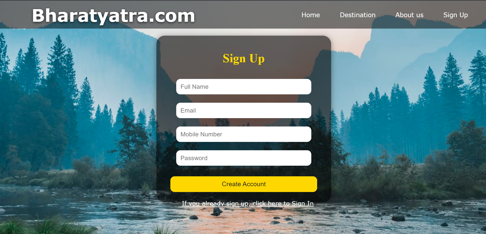

# 🌏 BharatYatra – Discover Incredible India  

BharatYatra is a tourism-based web application where users can explore famous tourist destinations across India.  
The website fetches real-time information using the **Wikipedia API** and displays custom visuals designed using **PixelLab**.

---

## 🚀 Features

- 🏞️ Explore popular tourist destinations  
- 🔎 Real-time information from Wikipedia API  
- 🎨 PixelLab-designed images & banners  
- 📱 Fully responsive user interface  
- ⚡ Fast and lightweight website  
- 🌐 Clean and simple user experience  

---

## 🛠️ Tech Stack

### **Frontend**
- HTML  
- CSS  
- JavaScript  

### **Media Creation**
- PixelLab (Images, Thumbnails, Banners)

### **API**
- Wikipedia API (REST API)  
- JavaScript Fetch API  

### **Tools**
- AI (ChatGPT) — JavaScript logic assistance  
- GitHub Pages — Deployment  

---

## 📸 Screenshots

Place your images:

### **1. 🏠 Home Page** 

### **2. 📍 Popular Destinations Page**

### **3. 📘 About Page**

### **4. 📝 Signup Page**

